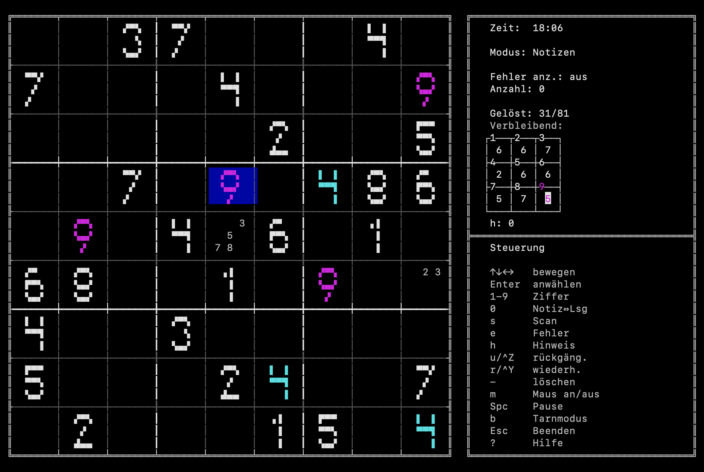

# clisudoku

A fully-featured Sudoku game that lives entirely in your terminal.



## About

Some programs just feel right when they run in a terminal — no mouse required, pure keyboard flow, instant response. Sudoku is one of them. This project grew out of a love for that kind of software: the kind where every key press does exactly what you expect, where the interface gets out of the way, and where you can sit down, focus, and think.

## Features

- **6 difficulty levels** — Easy · Medium · Hard · Extreme · Expert · Just 17
- **Hint system** — step-by-step hints with cause / elimination / target highlighting (20+ strategies)
- **Notes mode** — pencil marks per cell, auto-cleared on digit entry
- **Undo / redo** — full move history
- **Passive scan** — highlights all cells with the same digit as the cursor
- **Mouse support** — click to select, hover highlights the cell
- **3 colour themes** — Dark (default) · Light · High Contrast (colourblind-safe)
- **13 interface languages** — EN · DE · ES · IT · FR · SL · EO · TP · Leet · SW · AF · PY · ID
- **2 digit styles** — Retro · Awkward-Retro
- **Boss key** — instant blank screen (`B`)
- **Configurable keybindings** — via `~/.config/clisudoku/config.toml`
- **Load a custom puzzle** — paste an 81-char string or point to a file
- **Custom cell patterns** — generate puzzles from an 81-char pattern mask

## Requirements

- Rust 1.70+
- A terminal with 16-colour ANSI support (xterm, iTerm2, Windows Terminal, …)
- Minimum terminal size: 117 × 39 characters

## Installation

```bash
git clone https://github.com/DocAtPrompt/clisudoku.git
cd clisudoku
cargo build --release
# Binary: target/release/clisudoku
```

Or install globally:

```bash
cargo install --path .
```

## Usage

```
clisudoku [OPTIONS]

Options:
  -s <PUZZLE>         Load puzzle from 81-char string (1-9 = given, 0/. = empty)
  -f <FILE>           Load puzzle from text file (same format as -s)
  --pattern <81C>     Generate puzzle from a custom cell-pattern mask
  -t <NAME>           Colour theme: dark (default) | light | high-contrast
  -l <CODE>           Language: en de es it fr sl eo tp leet sw af py id
  --difficulty <L>    Starting difficulty: easy medium hard extreme expert
  --digit-style <S>   Digit style: retro (default) | awkward-retro
  --config <PATH>     Config file (default: ~/.config/clisudoku/config.toml)
```

### Examples

```bash
# Start with a specific puzzle
clisudoku -s 530070000600195000098000060800060003400803001700020006060000280000419005000080079

# Generate a puzzle using a custom cell pattern (1/* = given position, ./0 = empty)
clisudoku --pattern "1000100010001000100010001000100010001000100010001000100010001000100010001000100010001"

# Light theme, German interface
clisudoku -t light -l de

# High-contrast theme, start on Hard
clisudoku -t high-contrast --difficulty hard
```

## Controls

| Key | Action |
|-----|--------|
| `↑ ↓ ← →` | Move cursor |
| `1`–`9` | Enter digit |
| `0` | Toggle notes / digit mode |
| `-` | Clear cell |
| `Z` / `Y` | Undo / Redo |
| `H` | Request hint |
| `S` | Toggle passive scan |
| `E` | Toggle error highlighting |
| `Space` | Pause |
| `M` | Toggle mouse mode |
| `B` | Boss key (blank screen) |
| `?` | Help screen (controls, rules, colour reference) |
| `Q` / `Esc` | Quit / Back |

Numpad navigation: press a numpad key to jump to a 3×3 box, then press again to pick the cell inside it.

## Difficulty levels

| Level | What it requires |
|-------|-----------------|
| Easy | Naked & hidden singles only |
| Medium | Naked pairs, box-line reduction |
| Hard | X-Wing |
| Extreme | Swordfish, Jellyfish |
| Expert | XY-Wing, XYZ-Wing, chains, unique rectangles, … |
| Just 17 | Exactly 17 clues — the mathematical minimum for a unique solution |

## Configuration

`~/.config/clisudoku/config.toml`:

```toml
[appearance]
theme = "dark"          # dark | light | high-contrast
language = "en"         # en de es it fr sl eo tp leet sw af py id
digit_style = "retro"   # retro | awkward-retro

[keys]
hint = "h"
pause = " "
scan = "s"
errors = "e"
undo = "z"
redo = "y"

# Override individual colours (applied on top of the chosen theme).
# Valid colour names: Black, DarkGrey, Red, DarkRed, Green, DarkGreen,
#   Yellow, DarkYellow, Blue, DarkBlue, Magenta, DarkMagenta,
#   Cyan, DarkCyan, White, Grey
[colors]
digit_user = "Cyan"           # colour for digits you entered
digit_given = "White"         # colour for pre-filled (given) digits
digit_error = "Red"           # colour for conflicting digits
digit_scan = "Magenta"        # colour for passive-scan highlights
ui_cursor_bg = "DarkBlue"     # cursor / selected-tab background
cell_active_box_bg = "DarkBlue"   # same-box highlight background
hint_cause_border = "Green"   # hint: cause cell border
hint_elim_border = "Red"      # hint: elimination cell border
hint_target_bg = "Yellow"     # hint: target cell background
```

## Upcoming

Features planned for future releases:

- **Statistics & history** — persistent game database with solve times, difficulty breakdown, and streaks
- **Network challenge** — play head-to-head against others on the same puzzle in real time
- **X-Sudoku** — diagonal constraint variant (both main diagonals must also contain 1–9)
- **Killer Sudoku** — cage constraints with sum targets instead of given digits

## License

MIT

---

*Built with ❤️ and support from Claude.*
